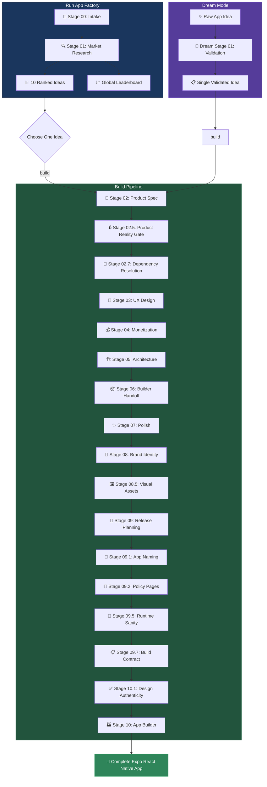

# App Factory CLI

A standalone command-line tool for generating store-ready Expo React Native applications using Claude AI.

This CLI executes the same production-grade pipeline as the main App Factory, but operates independently using your Anthropic API key.

## What This CLI Does

The App Factory CLI transforms app ideas into complete, polished Expo React Native applications ready for submission to the Apple App Store and Google Play Store.

**This is NOT Claude Code.** This is a separate runner that communicates with the Claude API using your own API keys.

## Prerequisites

- **Node.js 18+** - Required for ES modules and modern JavaScript features
- **npm** - Comes with Node.js
- **Anthropic API Key** - Get one at [console.anthropic.com](https://console.anthropic.com/)
- **This repository** - The CLI requires `the_factory/` directory structure

## Installation

```bash
# Navigate to the CLI directory
cd CLI

# Install dependencies
npm install

# Copy and configure environment
cp .env.example .env
# Edit .env and add your ANTHROPIC_API_KEY
```

## Quick Start

```bash
# Start the interactive CLI
npm start
```

This launches an interactive menu where you can:
- Use **arrow keys** to navigate options
- Press **Enter** to select
- Press **Ctrl+C** to exit at any time

## Interactive Menu

When you run `npm start`, you'll see the main menu:

```
┌──────────────────────────────────────────────────────────────┐
│                        MAIN MENU                              │
│    Use arrow keys to navigate, Enter to select                │
├──────────────────────────────────────────────────────────────┤
│  1. Run App Factory      Generate 10 ranked app ideas         │
│  2. Build an Idea        Build a selected idea into an app    │
│  3. Dream Mode           Your idea → complete app (end-to-end)│
│  4. List Runs & Builds   View recent runs and builds          │
│  5. Resume Run           Resume an interrupted pipeline       │
│  6. System Check         Verify environment and dependencies  │
│  7. Help                 Show detailed documentation          │
│  8. Exit                 Exit the CLI                         │
└──────────────────────────────────────────────────────────────┘
```

### Menu Options Explained

| Option | What It Does |
|--------|--------------|
| **Run App Factory** | Executes Stage 01 to generate 10 ranked mobile app ideas based on current market research. You can use default research or provide custom requirements. |
| **Build an Idea** | Select an idea from a previous run and build it through Stages 02-10, producing a complete Expo React Native app. |
| **Dream Mode** | Enter your own app idea description and watch it transform into a complete, store-ready app. Runs the entire pipeline end-to-end. |
| **List Runs & Builds** | View your recent pipeline runs, completed builds, and generated ideas. Useful for finding idea IDs. |
| **Resume Run** | If a pipeline run was interrupted, resume from where it left off. |
| **System Check** | Verify that your environment is correctly configured (API key, Node.js, dependencies). |
| **Help** | Display detailed documentation and keyboard shortcuts. |

## Command Line Usage

For scripting or CI/CD, you can also use direct commands:

```bash
# Generate 10 app ideas
npm start -- run

# Build a specific idea
npm start -- build <idea_id>

# End-to-end from your idea
npm start -- dream "a meditation app for busy professionals"

# Check environment
npm start -- doctor

# List runs and builds
npm start -- list

# Output as JSON (for CI)
npm start -- run --json
```

## Workflow Example

Here's a typical workflow:

1. **Start the CLI**
   ```bash
   npm start
   ```

2. **Run System Check** (first time)
   - Select "System Check" to verify your setup
   - Ensure all checks pass (especially API key)

3. **Generate Ideas**
   - Select "Run App Factory"
   - Choose default or custom requirements
   - Wait for 10 ranked ideas to be generated

4. **Build an App**
   - Select "Build an Idea"
   - Choose an idea from the list (sorted by score)
   - Wait for the full build pipeline to complete

5. **Use Your App**
   ```bash
   cd the_factory/builds/<your_app>/app
   npm install
   npx expo start
   ```

## Environment Variables

Create a `.env` file with:

```bash
# Required
ANTHROPIC_API_KEY=sk-ant-your-api-key-here

# Optional
ANTHROPIC_MODEL=claude-sonnet-4-20250514
APPFACTORY_MAX_TOKENS=16000
APPFACTORY_TEMPERATURE=0.3
```

| Variable | Required | Default | Description |
|----------|----------|---------|-------------|
| `ANTHROPIC_API_KEY` | Yes | - | Your Anthropic API key (starts with `sk-ant-`) |
| `ANTHROPIC_MODEL` | No | `claude-sonnet-4-20250514` | Claude model to use |
| `APPFACTORY_MAX_TOKENS` | No | `16000` | Maximum tokens per response |
| `APPFACTORY_TEMPERATURE` | No | `0.3` | Generation temperature (0.0-1.0) |

## Output Structure

### Runs (Generated Ideas)

```
the_factory/runs/YYYY-MM-DD/<run_id>/
├── inputs/
│   └── 00_intake.md              # Input requirements
├── stage01/
│   └── stages/stage01.json       # 10 ranked ideas
├── ideas/
│   └── 01_appname__id/           # Idea directories
│       └── meta/
│           ├── idea.json         # Idea metadata
│           └── stage_status.json # Build progress
└── meta/
    ├── run_manifest.json         # Run state
    └── idea_index.json           # Idea lookup
```

### Builds (Complete Apps)

```
the_factory/builds/<idea_dir>/
├── app/
│   ├── package.json
│   ├── app.json
│   ├── App.js
│   ├── src/
│   │   ├── screens/
│   │   ├── components/
│   │   └── services/
│   └── assets/
├── build_log.md
└── sources.md
```

## Troubleshooting

### "ANTHROPIC_API_KEY not set"

1. Ensure `.env` file exists in the CLI directory
2. Check the key starts with `sk-ant-`
3. Verify the key is valid at [console.anthropic.com](https://console.anthropic.com/)

### "Repository structure invalid"

The CLI requires the full repository with `the_factory/` directory:
- `the_factory/templates/agents/` - Stage templates
- `the_factory/schemas/` - JSON schemas
- `the_factory/scripts/` - Enforcement scripts

### Rate Limiting

If you see rate limit errors:
1. Wait a few minutes and retry
2. Consider using a higher-tier API plan

### Build Failures

Stage 10 has mandatory enforcement gates. If a build fails:
1. Check the specific error message
2. Manual fixes may be needed in the generated code
3. Re-run the build after fixing issues

## Project Structure

```
CLI/
├── src/
│   ├── index.ts              # CLI entrypoint
│   ├── interactive.ts        # Interactive menu runner
│   ├── commands/             # Command implementations
│   │   ├── run.ts            # Stage 01 execution
│   │   ├── build.ts          # Stages 02-10 execution
│   │   ├── dream.ts          # End-to-end execution
│   │   ├── doctor.ts         # Environment validation
│   │   ├── list.ts           # Run/build listing
│   │   └── resume.ts         # Resume interrupted runs
│   ├── core/                 # Core modules
│   │   ├── anthropic.ts      # Anthropic API client
│   │   ├── pipeline.ts       # Pipeline orchestration
│   │   ├── stages.ts         # Stage execution
│   │   ├── io.ts             # File operations
│   │   ├── logging.ts        # Structured logging
│   │   ├── paths.ts          # Path resolution
│   │   ├── locks.ts          # Concurrency control
│   │   └── ports.ts          # Port utilities
│   └── ui/                   # User interface
│       ├── banner.ts         # ASCII banner
│       ├── menu.ts           # Interactive menu system
│       ├── prompts.ts        # User prompts
│       └── format.ts         # Output formatting
├── tests/
│   └── smoke.ts              # Smoke tests
├── .audit/
│   ├── cli_repo_audit.md     # Repository audit
│   └── cli_implementation_report.md
├── package.json
├── tsconfig.json
├── .env.example
├── .gitignore
└── README.md
```

## How App Factory Works

The CLI executes the same production-grade pipeline as the main App Factory, with professional enforcement gates ensuring every build is production-ready:



### Pipeline Stages Summary

| Stage | Name | Purpose |
|-------|------|---------|
| 01 | Market Research | Generate 10 ranked app ideas |
| 02 | Product Spec | Define product requirements |
| 02.5 | Product Reality | Core loop and domain model |
| 02.7 | Dependency Resolution | Plan dependencies |
| 03 | UX Design | Design user experience |
| 04 | Monetization | Pricing and subscriptions |
| 05 | Architecture | Technical architecture |
| 06 | Builder Handoff | Implementation details |
| 07 | Polish | Quality standards |
| 08 | Brand | Brand identity |
| 08.5 | Visual Assets | Icons and splash screens |
| 09 | Release Planning | ASO and launch strategy |
| 09.1 | App Naming | Final app name |
| 09.2 | Policy Pages | Privacy policy and terms |
| 09.5 | Runtime Sanity | Verification harness |
| 09.7 | Build Contract | Authoritative build spec |
| 10.1 | Design Authenticity | Design verification |
| 10 | App Builder | Generate Expo React Native app |

## Keyboard Shortcuts

| Key | Action |
|-----|--------|
| `↑` / `↓` | Navigate menu options |
| `Enter` | Select option |
| `Ctrl+C` | Exit / Cancel |

## Development

### Building from Source

```bash
cd CLI
npm install
npm run build
```

### Running Tests

```bash
npm run smoke
```

## License

This CLI is part of the App Factory monorepo. See the root LICENSE file for details.

## Support

For issues and feature requests, please open an issue in the main repository.
