<p align="center">
  
</p>

# App Factory & Web3 Factory

**Dual AI-Native Development Systems**

This repository contains two isolated factory systems:
- **App Factory** (`/the_factory/`) - Consumer mobile apps with subscription monetization  
- **Web3 Factory** (`/web3-factory/`) - **🚧 IN DEVELOPMENT 🚧** - Tokenized web apps with onchain integration

## 🏭 Choose Your Factory

### 📱 App Factory - Consumer Mobile Apps
**From market research to production-ready mobile apps in three magical commands.**

App Factory is an intelligent pipeline that researches real market opportunities, generates validated app ideas, and builds complete React Native mobile applications.

**What makes it different**: Every generated app traces back to real market evidence. No generic templates, no disconnected specs—just apps built to solve actual user problems with validated business models.

### 🌐 Web3 Factory - Tokenized Web Applications  
**Transform ideas into tokenized web apps with Solana integration.**

**🚧 IN DEVELOPMENT 🚧**

Web3 Factory validates Web3 concepts, defines token economics, and builds complete tokenized web applications with Bags SDK integration.

**What makes it different**: Every token has a justified utility role, and every web app meaningfully benefits from onchain state.

## 🚀 Quick Start Guide

### For App Factory (Mobile Apps)
```bash
cd the_factory

# Generate 10 ranked mobile app ideas
run app factory

# Build a selected app  
build <IDEA_NAME>

# Or transform any idea into an app instantly ✨
dream your app idea here...
```

### For Web3 Factory (Tokenized Web Apps)  
```bash
cd web3-factory

# Transform idea into tokenized web app
web3 idea your tokenized app idea here...
```

## 📊 Architecture Comparison

| Aspect | App Factory | Web3 Factory |
|--------|-------------|--------------|
| **Target Platform** | iOS/Android Mobile | Web Browsers |
| **Framework** | React Native + Expo | Next.js/Vite + React |
| **Monetization** | Subscriptions (RevenueCat) | Tokens (Bags SDK) |
| **Pipeline** | Stages 01-10 | Stages W1-W5 |
| **Output** | Complete mobile apps | Complete web apps |
| **Blockchain** | None | Solana |

## How App Factory Works

App Factory runs in stages, with each stage building on previous outputs to create a complete, connected specification:

```mermaid
graph TD
    %% Traditional Research Mode
    A[📝 Stage 00: Intake] --> B[🔍 Stage 01: Market Research]
    B --> C[📊 10 Ranked Ideas]
    C --> D{Choose One Idea}
    D --> E[📋 Stage 02: Product Spec]
    
    %% Dream Mode ✨
    Z[✨ Raw App Idea] --> Y[🔮 Dream Stage 01: Validation]
    Y --> X[📝 Single Validated Idea]
    X --> E
    
    %% Shared Pipeline
    E --> F[🎨 Stage 03: UX Design]
    F --> G[💰 Stage 04: Monetization]
    G --> H[🏗️ Stage 05: Architecture]
    H --> I[🔧 Stage 06-09: Polish & Brand]
    I --> J[📱 Stage 10: React Native App]
    
    %% Outputs
    B --> K[📈 Global Leaderboard]
    J --> L[🚀 Production-Ready App]
    
    %% Command Labels
    A -.-> |"run app factory"| B
    Z -.-> |"dream <idea>"| Y
    D -.-> |"build <idea>"| E
    
    %% Styling
    classDef dreamMode fill:#9333ea,stroke:#7c3aed,stroke-width:2px,color:#fff
    classDef traditional fill:#1f2937,stroke:#374151,stroke-width:2px,color:#fff
    classDef shared fill:#059669,stroke:#047857,stroke-width:2px,color:#fff
    
    class Z,Y,X dreamMode
    class A,B,C,D traditional
    class E,F,G,H,I,J,L shared
```



**Stage-by-Stage Output:**
| Stage | Purpose | Key Output | Why It Matters |
|-------|---------|------------|----------------|
| 01 | Market Research | `stage01.json` (10 ranked ideas) | Evidence-backed opportunities |
| 02 | Product Spec | `stage02.json` (features, users, metrics) | What to build and why |
| 03 | UX Design | `stage03.json` (wireframes, flows, accessibility) | How users interact |
| 04 | Monetization | `stage04.json` (pricing, subscriptions, RevenueCat) | How it makes money |
| 05-09 | Architecture & Brand | `stage05-09.json` (tech stack, polish, ASO) | How it's built and positioned |
| 10 | App Generation | `builds/<idea>/app/` (complete Expo app) | What you ship |

## 🏭 Directory Structure

### App Factory (`/the_factory/`)
```
the_factory/
├── CLAUDE.md                     # App Factory control plane
├── README.md                     # App Factory documentation
├── templates/                    # Stage execution templates  
├── schemas/                      # JSON validation schemas
├── runs/                         # Generated pipeline outputs
├── builds/                       # Built React Native apps
└── ...                          # Core App Factory system
```

### Web3 Factory (`/web3-factory/`)
```
web3-factory/
├── CLAUDE.md                     # Web3 Factory control plane
├── README.md                     # Web3 Factory documentation  
├── templates/                    # W1-W5 stage templates
├── schemas/                      # Web3 validation schemas
├── constants/                    # Bags SDK configuration
├── utils/                        # Web3 utilities
├── runs/                         # Generated Web3 outputs
└── builds/                       # Built tokenized web apps
```

## App Factory Commands

**Navigate to `/the_factory/` and open Claude in that directory:**

### Generate 10 Ranked App Ideas
```
run app factory
```
*Researches markets and generates 10 ranked mobile app ideas for selective building*

### Build Selected App  
```
build <IDEA_NAME>
```  
*Builds ONE chosen idea into a complete production-ready mobile app*

### ✨ Dream Mode: Instant App from Raw Idea
```
dream your app idea here...
```
*Transform any mobile app idea into a complete app in one shot!*

## Web3 Factory Commands

**Navigate to `/web3-factory/` and open Claude in that directory:**

### Transform Idea into Tokenized Web App
```
web3 idea your tokenized app idea here...
```
*Validates Web3 concept, defines token economics, and builds complete tokenized web app*

## Example Workflows

### App Factory Workflows (Mobile Apps)

**Traditional Workflow (Research → Build):**
```bash
cd the_factory

# Step 1: Generate 10 ranked mobile app ideas
run app factory

# Step 2: Pick your favorite idea and build it completely
build "FocusFlow AI"

# Result: One complete mobile app ready for App Store submission
```

**✨ Dream Workflow (Idea → App):**
```bash
cd the_factory

# Single command: Turn any idea into a complete mobile app
dream I want to create a meditation app that generates personalized soundscapes based on your current location and weather

# Result: Complete production-ready mobile app built from your imagination ✨
```

### Web3 Factory Workflow (Tokenized Web Apps)

**Tokenized App Creation:**
```bash
cd web3-factory

# Single command: Transform idea into tokenized web app
web3 idea Create a decentralized habit tracking app where users earn tokens for consistency and can tip other users for motivation

# Result: Complete tokenized web app with Solana integration and justified token utility
```

## Why This Is Different

**Connected Decisions, Not Isolated Templates**

Most AI tools generate disconnected outputs. App Factory ensures every specification connects:

- Market research **directly informs** product features
- Product features **directly inform** UX wireframes  
- UX wireframes **directly inform** technical architecture
- Technical architecture **directly informs** the actual React Native code
- Monetization strategy **directly informs** RevenueCat integration
- Brand identity **directly informs** UI theme and styling

**Result**: Every line of generated code traces back to market evidence.

**Selective Execution, Not Batch Waste**

App Factory gives you choice and control:

- Generate 10 ideas quickly, then choose your winner  
- Build only the idea you want
- No wasted tokens on apps you'll never use
- No commitment until you explicitly choose to build

## Truth Enforcement

**Success is files-on-disk.** No stubs, no placeholders, no false success claims.

✅ All 100+ JSON outputs validate against schemas  
✅ All execution steps documented in logs  
✅ All specifications rendered to markdown  
✅ Built apps are complete and runnable for the selected idea  
✅ Every constraint maps to actual implementation  

**If it's not written to disk with binding proof, it didn't happen.**

## Tech Stack

**Modern, Proven, Store-Ready**

- **Framework**: React Native + Expo (latest stable)
- **Navigation**: Expo Router (file-based)
- **Monetization**: RevenueCat (subscription-first)
- **Storage**: AsyncStorage + SQLite
- **Auth**: Guest-first, optional accounts
- **Platforms**: iOS + Android simultaneously

**Why These Choices**: Each technology decision traces back to market research and monetization strategy from your specifications.

## Getting Started

**Prerequisites**: Claude subscription + this repository

### For App Factory (Mobile Apps)
```bash
# 1. Clone the repository
git clone <this-repo>
cd app-factory

# 2. Navigate to App Factory
cd the_factory

# 3. Open Claude and point it to the_factory directory  
# (Claude will automatically read CLAUDE.md constitution)

# 4. Generate complete specifications for 10 mobile app ideas
run app factory

# 5. Build your favorite idea into a complete mobile app
build "Your Chosen Idea Name"

# OR: Skip research and turn any idea directly into a mobile app! ✨
dream your amazing mobile app idea in plain English...

# 6. Your mobile app is ready in builds/ directory
cd builds/01_your_idea__idea_id_001/<build_id>/app
npm install
npm start
```

### For Web3 Factory (Tokenized Web Apps)
```bash
# 1. Clone the repository (if not already done)
git clone <this-repo>
cd app-factory

# 2. Navigate to Web3 Factory
cd web3-factory

# 3. Open Claude and point it to web3-factory directory
# (Claude will automatically read Web3 Factory CLAUDE.md)

# 4. Transform any idea into a tokenized web app
web3 idea your tokenized app concept here...

# 5. Your tokenized web app is ready in builds/ directory
cd builds/<app_name>/
npm install
npm start
```

**That's it.** No configuration, no prompts, no hand-holding.

---

## ✨ Dream Mode: Where Ideas Become Apps ✨

**Sometimes you have an idea and you just want it to exist. Right now. Dream Mode is magic for your brain.**

### 🌟 What is Dream Mode?

Dream Mode takes any app idea you can imagine and transforms it into a complete, production-ready React Native app in a single command. No research phase, no choosing from options—just pure idea-to-app alchemy.

### 🪄 How It Works

1. **Speak your mind**: Describe your app in plain English
2. **Dream validates**: Instantly validates your idea and structures it 
3. **Magic happens**: Runs the complete pipeline from research to code
4. **App appears**: Your idea becomes a working React Native app ✨

### 🎭 Dream Examples

```bash
# 🎵 Music & Audio
dream Create a white noise app that learns your sleep patterns and automatically adjusts sounds throughout the night

# 📚 Learning & Education  
dream I want a flashcard app for medical students that uses spaced repetition and tracks which topics you struggle with most

# 🎮 Games & Entertainment
dream Build a daily word puzzle game where you have to guess the word by its shadow shape

# 🏠 Life & Productivity
dream Make an app that helps roommates split bills and chores fairly without the awkward conversations

# 🌱 Health & Wellness
dream Design a plant care app that sends smart reminders based on each plant's actual needs and your local weather

# 🎨 Creative & Design
dream I want to create a color palette generator that uses your phone's camera to extract colors from real world objects

# 🧠 Mind & Focus
dream Build a meditation app that creates personalized guided sessions based on your stress level and available time
```

### 🎪 Dream Mode Special Powers

- **🚀 Instant Gratification**: One command from idea to working app
- **🧠 Mind Reading**: Understands vague ideas and makes them concrete
- **⚡ No Decisions Required**: No choosing from 10 options—just build YOUR idea
- **🎨 Creative Freedom**: Any app idea you can imagine, Dream Mode can build
- **🔮 Magic Pipeline**: Validates, specifies, designs, and codes automatically
- **✨ Pure Joy**: Skip the planning, get straight to the fun part

### 🌈 Perfect For...

- **💡 Late Night Inspiration**: "What if there was an app that..."
- **🚀 Rapid Prototyping**: Get from concept to working app in minutes
- **🎯 Specific Solutions**: "I need an app that does exactly this thing"
- **🎪 Creative Experiments**: Wild ideas that need to exist in the world
- **⚡ Speed Demons**: When research feels like too much work
- **🦄 Unicorn Hunting**: Building something that doesn't exist yet

### 🪄 The Dream Experience

```
You: dream Create a habit tracker that only tracks one habit at a time and uses visual dots to show progress

Claude: ✨ *Understanding your vision...*
         🔍 *Researching similar apps...*  
         📝 *Structuring your idea...*
         🎨 *Designing the experience...*
         💰 *Planning monetization...*
         🏗️  *Building your app...*
         
         🎉 Your dream is reality! 
         
         App created: builds/01_habit_dot__habit_dot_001/
```

**Dream Mode turns "what if" into "here it is" ✨**

---

## Who This Is For

**Builders who want outcomes, not processes:**

✅ **Indie developers** - Generate validated app ideas + complete implementations  
✅ **Agencies** - Deliver complete mobile apps with full documentation  
✅ **Product managers** - Get market-backed specifications for any app concept  
✅ **Entrepreneurs** - Turn market research into store-ready applications  
✅ **Technical founders** - Skip months of specification work  

**Not for**: Teams that enjoy writing specifications manually, or developers who prefer building everything from scratch.

**Perfect for**: Anyone who wants to ship mobile apps faster with market validation baked in.

## Output Structure

### App Factory Output Structure

**After `run app factory` (idea generation):**

```
the_factory/runs/YYYY-MM-DD/your-run-name/
├── stage01/
│   ├── stages/stage01.json               # 10 ranked mobile app ideas
│   └── spec/01_market_research.md
├── ideas/                                # Idea bin (metadata only)
│   ├── 01_focusflow_ai__focus_ai_001/
│   │   └── meta/                         # Metadata only
│   ├── 02_mindful_habits__habits_002/
│   │   └── meta/                         # Metadata only
│   └── ...                               # 8 more idea directories
└── meta/
    └── idea_index.json                   # Master index for building
```

**After `build "FocusFlow AI"` (selective building):**

```
the_factory/builds/01_focusflow_ai__focus_ai_001/     # Built mobile app
└── <build_id>/                                      # Immutable build output
    ├── app/                                         # Complete Expo app
    │   ├── package.json                             # Complete Expo config
    │   ├── src/screens/                             # All mobile app screens
    │   ├── src/services/purchases.js                # RevenueCat integration
    │   └── README.md                                # Setup instructions
    ├── build_log.md                                 # Build execution log
    └── sources.md                                   # Research citations

the_factory/runs/YYYY-MM-DD/your-run-name/ideas/01_focusflow_ai__focus_ai_001/
├── stages/                                          # Now contains stages 02-10
├── outputs/                                         # All execution logs
└── spec/                                            # Complete specifications
```

### Web3 Factory Output Structure

**After `web3 idea "Tokenized habit tracker"` (tokenized web app):**

```
web3-factory/builds/<app_name>/
├── src/                                 # Complete Next.js/Vite web app
├── package.json                         # Web app dependencies
├── token_metadata.json                  # Created Solana token details
└── README.md                            # Deployment instructions

web3-factory/runs/YYYY-MM-DD/web3-<timestamp>-<hash>/
├── w1/web3_idea.json                   # Validated Web3 concept
├── w2/token_model.json                 # Token economics
├── w3/web3_architecture.json           # Web app architecture
├── w4/bags_config.json                 # Bags SDK configuration
└── w5/build_manifest.json              # Build plan and token creation
```

## Repository Hygiene

**Generated outputs** are ignored by git and never committed:

- **`the_factory/runs/`** - All App Factory pipeline execution outputs and specifications
- **`the_factory/builds/`** - Complete React Native apps built from selected ideas
- **`web3-factory/runs/`** - All Web3 Factory pipeline execution outputs
- **`web3-factory/builds/`** - Complete tokenized web apps with Solana integration

**Clean repository**: `the_factory/scripts/clean_repo.sh`  
**Check ship-readiness**: `the_factory/scripts/ship_check.sh`

All builds go to respective `builds/<app_dir>/` directories - never fixed locations.

## What You Get

### App Factory Outputs

**After `run app factory`**:
- 10 ranked, validated mobile app ideas with market evidence
- Complete market research specifications in markdown
- Global leaderboard tracking all ideas across runs
- Ready-to-build idea bin for selective development

**After `build <IDEA_NAME>`**:
- Complete React Native mobile app with full source code
- Production-ready Expo configuration
- Integrated RevenueCat subscription system
- Store-submission-ready mobile application
- Complete technical specifications and documentation
- **Live preview capability** with QR codes for instant mobile testing

### Web3 Factory Outputs

**After `web3 idea <CONCEPT>`**:
- Validated Web3 concept with justified token utility
- Complete token economics and supply model
- Production-ready web app with Solana integration
- Created Solana token via Bags SDK
- Deterministic deployment configuration
- Complete Web3 specifications and documentation

## Quickstart

### App Factory (Mobile Apps)

**🔬 Research Mode (Traditional)**
1. **Navigate**: `cd the_factory`
2. **Open Claude** in the_factory directory
3. **Type**: `run app factory`  
4. **Choose** your favorite from 10 ranked mobile app ideas
5. **Type**: `build "Your Chosen Idea"`
6. **Test**: Launch live preview with QR codes for instant mobile testing
7. **Ship**: Your mobile app is ready in `builds/` directory

**✨ Dream Mode (Magic)**
1. **Navigate**: `cd the_factory`
2. **Open Claude** in the_factory directory
3. **Type**: `dream your amazing mobile app idea here...`
4. **Wait**: Watch your idea become a complete mobile app
5. **Test**: Launch live preview with QR codes for instant mobile testing
6. **Ship**: Your dream mobile app is ready in `builds/` directory

### Web3 Factory (Tokenized Web Apps)

**🌐 Tokenized App Creation**
1. **Navigate**: `cd web3-factory`
2. **Open Claude** in web3-factory directory  
3. **Type**: `web3 idea your tokenized app concept here...`
4. **Wait**: Watch your Web3 idea become a complete tokenized web app
5. **Test**: Launch your web app locally with `npm start`
6. **Ship**: Your tokenized web app is ready in `builds/` directory

No configuration, no prompts, no hand-holding.

## Leaderboard Explained

App Factory tracks every idea generated across all runs:

**Raw Leaderboard**: Permanent record of all ideas with original rankings  
**Global Leaderboard**: Best ideas across all runs, automatically updated  

Top ideas remain discoverable regardless of when they were generated.

## Live Preview

Test your built apps instantly on mobile devices with integrated live preview:

**Features**:
- 📱 **QR Code Generation** - Scan with Expo Dev Client for instant testing
- 🔗 **One-click DevTools** - Direct access to React DevTools and Metro
- 🔄 **Live Reloading** - See changes instantly on your device
- 🎯 **Auto-detection** - Automatically finds built apps for preview

**Quick Start**:
1. Build an app: `build "Your Idea"`
2. Start preview service: `cd preview && npm install && npm start`
3. Open dashboard, click any built app idea
4. Click "Launch Live Preview" and scan the QR code

**Requirements**: Node.js and Expo Dev Client on your mobile device

---

## Bags App

$FACTORY

**CA**: BkSbFrDMkfkoG4NDUwadEGeQgVwoXkR3F3P1MPUnBAGS

https://bags.fm/BkSbFrDMkfkoG4NDUwadEGeQgVwoXkR3F3P1MPUnBAGS

---

## Contributing

**Welcome Contributors!**

App Factory thrives on community input. Whether you're improving the pipeline, fixing bugs, or adding features, your contributions help everyone build better apps faster.

**Easy Ways to Start:**
- 🐛 **Report issues** - Found a bug? Let us know
- 💡 **Suggest improvements** - Ideas for better pipeline stages or features
- 📝 **Improve docs** - Make templates and guides clearer
- 🧪 **Add quality checks** - Help improve validation and reliability
- 🔧 **Submit PRs** - Code contributions always welcome

**Key Development Principles:**
- **Agent-native execution**: Claude is the primary runner
- **Filesystem truth**: No false success claims - if it's not on disk, it didn't happen
- **Schema validation**: Everything must validate against defined schemas
- **Connected specs**: Every decision traces back to market research evidence

**Getting Involved**: Check out issues, suggest improvements, or dive into the codebase. All skill levels welcome!

## License

**MIT License** - This project is open source and free to use. See LICENSE file for details.

## Support Open Source Development

App Factory is developed and maintained as an **open source project**. If this tool helps you build better mobile applications faster, please consider supporting its continued development.

### ⭐ Ways to Support

- **Star this repository** - Help others discover App Factory
- **Share the project** - Tell other developers about agent-native app generation
- **Contribute code** - Submit improvements and new features
- **Report issues** - Help us improve reliability and usability
- **Sponsor development** - Support ongoing maintenance and new features

### 💖 Become a Sponsor

Your sponsorship helps:
- 🚀 **Add new pipeline stages** for advanced app features
- 🔧 **Improve validation** and error handling
- 📱 **Support new frameworks** beyond React Native
- 🌐 **Enhance signal sources** for better market research
- 📚 **Create tutorials** and documentation
- 🐛 **Fix bugs** and performance issues

[**Sponsor App Factory on GitHub →**](https://github.com/sponsors/MeltedMindz)

Every contribution, whether code or financial, helps make App Factory better for the entire developer community. Thank you for supporting open source! 🙏

---

**App Factory: From market research to React Native code — in three magical commands.**